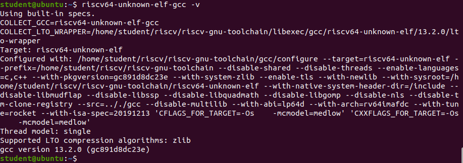

# Lab 0


In the first lab, we will guide you how to set up the development environment. We recomment using virtual machine, while you can also set up by yourself by following commands.

In addition, for other labs that involve writing Verilog, we provide brief [review slide](https://docs.google.com/presentation/d/14uxFjL9zJWCfVT6Br4R6vbNxkuXCLULN0YWwcnY_5ZA/edit?usp=sharing).

## Virtual Machine
Please search how to install **VMware workstation 17** on internet, and click [cloud link](https://drive.google.com/open?id=1E4y2BAJt8UGt3aKIF2QjL2CgAjDIwCiz&amp%3Busp=drive_copy&usp=drive_copy) to download the installer.

Virtual Machine VM
- Download : Please use the following command to download it (19GB, suggest preparing at least 50GB for VM):
  ```bash
  scp anonymous@sftp.userwei.com:/public/COVM_Ubuntu.zip .
  ``` 
- Platform: Ubuntu20.04 amd64
- Machine: COVM
- Account: student
- Password: student

## Setting up by yourself
If you have Ubuntu20.04, the following is setup guide, however, the process might take hours.

### tools
```
sudo apt install git
sudo apt install vim
```

### [riscv-gnu-toolchain](https://github.com/riscv-collab/riscv-gnu-toolchain)

[Reference](https://hackmd.io/@nx1bTzFpQvaKD_yxYRmBaQ/Skpx_8tSO)


Fetch source
```
mkdir riscv
cd riscv
git clone --recursive https://github.com/riscv/riscv-gnu-toolchain
```


Add two lines in the end of `~/.bashrc`
```
export RISCV="/home/{your_user_name}/riscv/riscv-gnu-toolchain"
export PATH=$PATH:$RISCV/bin
```

Reload `~/.bashrc`
```
source ~/.bashrc
```

Install Prequisite 
```
sudo apt-get install autoconf automake autotools-dev curl python3 python3-pip libmpc-dev libmpfr-dev libgmp-dev gawk build-essential bison flex texinfo gperf libtool patchutils bc zlib1g-dev libexpat-dev ninja-build git cmake libglib2.0-dev libslirp-dev
```


Compile and install
```
cd riscv-gnu-toolchain
./configure --prefix=$RISCV 
make -j$(nproc)
make linux -j $(nproc)
```

Check if installed successfully
```
riscv64-unknown-elf-gcc -v
```


### [riscv-tools](https://github.com/riscv/riscv-tools.git)

Clone the respository
```
git clone https://github.com/riscv/riscv-tools.git
cd riscv-tools
git submodule update --init --recursive
```

Prequsites
```
sudo apt-get install autoconf automake autotools-dev curl libmpc-dev libmpfr-dev libgmp-dev libusb-1.0-0-dev gawk build-essential bison flex texinfo gperf libtool patchutils bc zlib1g-dev device-tree-compiler pkg-config libexpat-dev
```

Build in `riscv-tools`
```
./build.sh
```

If success, the terminal shows in the end.
```
RISC-V Toolchain installation completed!
```

If running into `./machine/flush_icache.c:4: Error: unrecognized opcode 'fence.i', extension 'zifencei' required`
- Modify `./build.sh` append Line 22  `--with-arch=rv64gc_zifencei`
- Rerun `./build.sh`
```
# Original
CC= CXX= build_project riscv-pk --prefix=$RISCV --host=riscv64-unknown-elf 

# New
CC= CXX= build_project riscv-pk --prefix=$RISCV --host=riscv64-unknown-elf --with-arch=rv64gc_zifencei
```

If running into `multiple definition of 'host'` error
- Modify file `./riscv-tests/isa/Makefile`, append variable `RISCV_GCC_OPTS` with `-fcommon`
- Rerun `./build.sh`
```
# original
RISCV_GCC_OPTS ?= -static -mcmodel=medany -fvisibility=hidden -nostdlib -nostartfiles

# New
RISCV_GCC_OPTS ?= -static -mcmodel=medany -fvisibility=hidden -nostdlib -nostartfiles -fcommon
```

### Verilator

```
# Prerequisites:
sudo apt-get install git perl python3 make autoconf g++ flex bison ccache
sudo apt-get install libgoogle-perftools-dev numactl perl-doc
sudo apt-get install libfl2  # Ubuntu only (ignore if gives error)
sudo apt-get install libfl-dev  # Ubuntu only (ignore if gives error)
sudo apt-get install zlibc zlib1g zlib1g-dev  # Ubuntu only (ignore if gives error)

git clone https://github.com/verilator/verilator   # Only first time

# Every time you need to build:
unsetenv VERILATOR_ROOT  # For csh; ignore error if on bash
unset VERILATOR_ROOT  # For bash
cd verilator
git pull         # Make sure git repository is up-to-date
git tag          # See what versions exist
git checkout v5.008  # Switch to specified release version

autoconf         # Create ./configure script
./configure      # Configure and create Makefile
make -j `nproc`  # Build Verilator itself (if error, try just 'make')
sudo make install
```

Check
```
verilator --version
```

### gtkwave
```
sudo apt install gtkwave
```

### [Ripes](https://github.com/mortbopet/Ripes)
Just download the app image or use online version.
